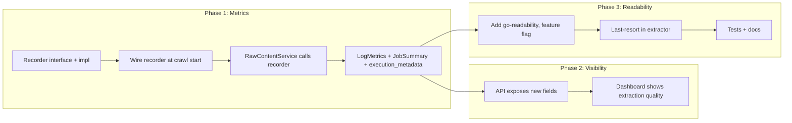

# Source Selectors: Recommendations Plan

This plan turns the earlier recommendations into concrete, actionable work: (1) **extraction quality metrics** so you can see when selectors are underperforming, and (2) an **optional readability fallback** when selectors and existing fallbacks yield insufficient content.

---

## Current state

- **Selectors**: Per-source CSS config (article/list/page) in [source-manager/internal/models/source.go](source-manager/internal/models/source.go); crawler applies them in [crawler/internal/content/rawcontent/service.go](crawler/internal/content/rawcontent/service.go) and [crawler/internal/content/rawcontent/extractor.go](crawler/internal/content/rawcontent/extractor.go). Fallback order: selector → OG/JSON-LD → generic heuristics.
- **Metrics**: Job execution metrics live in [crawler/internal/logs/metrics.go](crawler/internal/logs/metrics.go) (`LogMetrics`, `JobSummary`) and are persisted in execution `metadata` via [crawler/internal/scheduler/execution_metadata.go](crawler/internal/scheduler/execution_metadata.go) under `crawl_metrics`. There are no per-extraction quality counters (e.g. empty title/body).
- **Flow**: `RawContentService.Process` extracts via `ExtractRawContent`, then skips indexing if title and body are both empty or word count < 50. On success, [crawler/internal/crawler/processing.go](crawler/internal/crawler/processing.go) calls `IncrementItemsExtracted()`. The raw content layer does not have access to the job logger.

---

## 1. Extraction quality metrics

**Goal**: Record how many indexed items had empty title or empty/weak body so you can spot selector drift (e.g. site redesign) and prioritize selector updates.

### 1.1 Recording interface and wiring

- Define a small **extraction-quality recorder** interface (e.g. in `crawler/internal/content/rawcontent` or a shared `crawler/internal/content` package) with a single method, e.g. `RecordExtracted(emptyTitle, emptyBody bool)`. Keep it optional (nil-safe) so tests and non-crawler callers do not need a real implementation.
- Implement it in the **crawler** using the existing job logger: when `RecordExtracted` is called, update `LogMetrics` (two new atomic counters: e.g. `ItemsExtractedEmptyTitle`, `ItemsExtractedEmptyBody`).
- In [crawler/internal/crawler/constructor.go](crawler/internal/crawler/constructor.go): build the recorder implementation (it needs the same `JobLogger` that the crawler uses during `Start`). Pass the recorder into `RawContentService` (and thus into `NewProcessor` → service). The crawler does not have the job logger at construction time; the logger is set when a job starts. So the recorder must be **injected at crawl start** (when the crawler has the job logger), not at crawler construction. Options:
  - **Option A**: Add an optional `SetExtractionRecorder(ExtractionRecorder)` (or `SetJobLogger(JobLogger)`) on the raw content processor or service, called from the crawler’s `Start`/run path when the job logger is available. The recorder implementation holds a reference to the logger and forwards to `LogMetrics`.
  - **Option B**: Pass a factory `func() ExtractionRecorder` into the constructor; the crawler calls it when starting a job and passes the result to the processor/service. The processor calls the factory at process time to get the current recorder (if any).
- In [crawler/internal/content/rawcontent/service.go](crawler/internal/content/rawcontent/service.go): after a successful index (right before `return nil`), call `recorder.RecordExtracted(rawData.Title == "", bodyEmpty)` where `bodyEmpty` is e.g. `strings.TrimSpace(rawData.RawText) == ""` or word count < 1. Only call when the item was actually indexed (so counts align with `ItemsExtracted`).

### 1.2 Metrics and persistence

- **LogMetrics** ([crawler/internal/logs/metrics.go](crawler/internal/logs/metrics.go)): Add two atomic counters and getters; in `BuildSummary()`, add two fields to `JobSummary` (e.g. `ItemsExtractedEmptyTitle`, `ItemsExtractedEmptyBody`).
- **JobSummary** ([crawler/internal/logs/job_logger.go](crawler/internal/logs/job_logger.go)): Add the two fields to the struct and JSON tags.
- **Execution metadata** ([crawler/internal/scheduler/execution_metadata.go](crawler/internal/scheduler/execution_metadata.go)): In `BuildExecutionMetadata`, add an `extraction_quality` (or include in existing `crawl_metrics`) object with e.g. `items_indexed`, `empty_title_count`, `empty_body_count` so downstream consumers can compute rates. Persist under the same `crawl_metrics` key for consistency.

### 1.3 Visibility (optional follow-up)

- **Crawler API**: Ensure job stats and/or execution list/detail responses include the new fields (they may already if they return `metadata.crawl_metrics` as-is). If not, add the new counters to the payload so the dashboard can show them.
- **Dashboard**: In [dashboard/src/views/intake/JobDetailView.vue](dashboard/src/views/intake/JobDetailView.vue) (or execution detail), show extraction quality for the run (e.g. “X items indexed, Y with empty title, Z with empty body”) when available.
- **Alerting**: Use execution history (e.g. last N runs) to compute a rate (e.g. empty_title_count / items_indexed). If rate exceeds a threshold (e.g. > 20%), trigger an alert or flag the source for selector review. This can be a separate task (cron job, Grafana rule, or MCP/workflow).

---

## 2. Optional readability fallback

**Goal**: When selectors and current fallbacks (container/body, OG, heuristics) yield no or very little content, try a readability-style algorithm to extract main content before skipping the page.

### 2.1 Where to plug in

- In [crawler/internal/content/rawcontent/extractor.go](crawler/internal/content/rawcontent/extractor.go), the body extraction flow is: `extractRawHTML` (selector → body selector → fallback list) and `extractRawText`. Add a **last-resort step**: if the resulting `RawHTML`/`RawText` is empty or below a minimal length (e.g. reuse `minHTMLContentLength` or a new constant), call a new helper that runs a readability-style extractor over the full document and returns main content HTML/text.
- Use a single, well-maintained Go library (e.g. [go-readability](https://github.com/go-shiori/go-readability)) to avoid maintaining algorithm code. Check license (Apache 2.0) and add to `crawler/go.mod` with a comment. Keep it **optional behind a build flag or config** (e.g. `CRAWLER_READABILITY_FALLBACK_ENABLED`) so deployments that do not want the dependency or extra CPU can disable it.

### 2.2 Behavior and defaults

- Only invoke when the existing pipeline has already failed (empty or negligible content). Do not replace selector-based or OG-based extraction when they succeed.
- After readability runs, apply the same exclude logic (e.g. strip script/style) and set `data.RawHTML` / `data.RawText` from the result. Ensure title extraction is unchanged (readability often returns a title; you can use it only when the current title is still empty to avoid regressions).
- Default: **disabled** (config or env off) so behavior is unchanged unless explicitly enabled. Document in [crawler/README.md](crawler/README.md) or [CLAUDE.md](CLAUDE.md).

### 2.3 Testing

- Unit test: mock HTML with no semantic containers; with readability fallback enabled, expect main content and title to be filled. With fallback disabled, expect current behavior (empty or fallback only).
- Optional: integration test with a real URL that has poor structure to confirm readability improves extraction when selectors fail.

---

## 3. Implementation order

1. **Phase 1 (metrics)**: Recorder interface and implementation; wire recorder into crawler start and into `RawContentService`; add counters to `LogMetrics`/`JobSummary`/`BuildExecutionMetadata`. No API or UI changes yet.
2. **Phase 2 (visibility)**: Expose new fields in crawler job/execution API if needed; add extraction quality to dashboard job/execution view. Optional: alerting rule or cron for high empty-title/empty-body rate.
3. **Phase 3 (readability)**: Add dependency and config flag; implement last-resort in extractor; tests and short doc update.

---

## 4. Files to touch (summary)

| Area                   | Files                                                                                                                                                                                                                                                                                                                                                                                            |
| ---------------------- | ------------------------------------------------------------------------------------------------------------------------------------------------------------------------------------------------------------------------------------------------------------------------------------------------------------------------------------------------------------------------------------------------ |
| Recorder interface     | New small type in `crawler/internal/content/rawcontent` (e.g. `recorder.go`) or under `crawler/internal/content`                                                                                                                                                                                                                                                                                 |
| Recorder impl + wiring | [crawler/internal/crawler/constructor.go](crawler/internal/crawler/constructor.go), crawler start/run path (e.g. [crawler/internal/crawler/start.go](crawler/internal/crawler/start.go)), [crawler/internal/content/rawcontent/processor.go](crawler/internal/content/rawcontent/processor.go), [crawler/internal/content/rawcontent/service.go](crawler/internal/content/rawcontent/service.go) |
| Metrics                | [crawler/internal/logs/metrics.go](crawler/internal/logs/metrics.go), [crawler/internal/logs/job_logger.go](crawler/internal/logs/job_logger.go), [crawler/internal/logs/job_logger_impl.go](crawler/internal/logs/job_logger_impl.go)                                                                                                                                                           |
| Execution metadata     | [crawler/internal/scheduler/execution_metadata.go](crawler/internal/scheduler/execution_metadata.go)                                                                                                                                                                                                                                                                                             |
| Readability fallback   | [crawler/internal/content/rawcontent/extractor.go](crawler/internal/content/rawcontent/extractor.go), crawler config (e.g. [crawler/internal/config](crawler/internal/config)), [crawler/go.mod](crawler/go.mod)                                                                                                                                                                                 |
| Visibility (optional)  | Crawler API handlers for job stats/executions, [dashboard/src/views/intake/JobDetailView.vue](dashboard/src/views/intake/JobDetailView.vue) and types                                                                                                                                                                                                                                            |

---

## 5. Out of scope

- Changing the selector schema or source-manager API.
- Replacing selector-based extraction with ML when selectors work.
- Per-source thresholds (e.g. “alert if this source’s empty rate > X”); can be added later on top of the new metrics.

