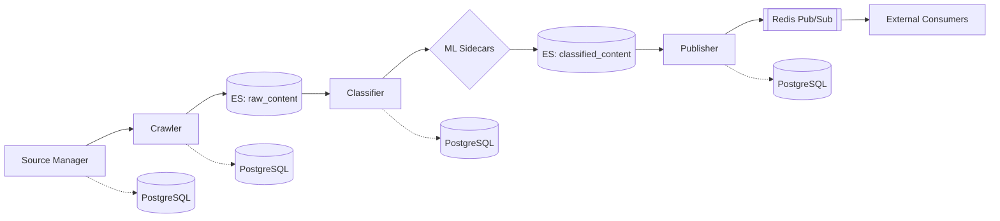
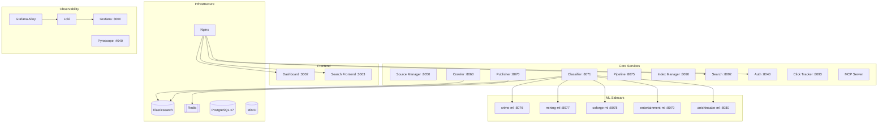

# North Cloud

A microservices content pipeline for crawling, classifying, and distributing articles via Redis Pub/Sub.

## Pipeline



## Architecture



## Services

| Service | Port | Description |
|---------|------|-------------|
| **source-manager** | 8050 | Manage content sources and crawl configurations |
| **crawler** | 8060 | Web crawler with interval-based job scheduling |
| **classifier** | 8071 | Hybrid rule + ML classification (quality, topics, crime) |
| **publisher** | 8070 | Multi-layer routing to Redis Pub/Sub channels |
| **pipeline** | 8075 | Ingest per-article stage-transition events and expose a funnel view across crawled → indexed → classified → routed → published |
| **index-manager** | 8090 | Elasticsearch index and document management |
| **search** | 8092 | Full-text search across classified content |
| **auth** | 8040 | JWT authentication (24h tokens) |
| **mcp-north-cloud** | stdio | MCP server for AI integration (27 tools) |
| **dashboard** | 3002 | Management UI (Vue.js 3) |
| **search-frontend** | 3003 | Public search UI |
| **nc-http-proxy** | 8055 | HTTP replay proxy for deterministic testing |
| **click-tracker** | 8093 | Click event tracking and analytics |

### ML Sidecars

| Sidecar | Port | Description |
|---------|------|-------------|
| **crime-ml** | 8076 | Crime content classification |
| **mining-ml** | 8077 | Mining content classification |
| **coforge-ml** | 8078 | Coforge content classification |
| **entertainment-ml** | 8079 | Entertainment content classification |
| **anishinaabe-ml** | 8080 | Anishinaabe/Indigenous content classification |

## Quick Start

```bash
# 1. Clone and configure
git clone <repository-url>
cd north-cloud
cp .env.example .env

# 2. Start development environment
task docker:dev:up

# 3. Access the dashboard
open http://localhost:3002
```

## Development

```bash
# Start core services
task docker:dev:up

# Include observability (Loki, Grafana, Pyroscope)
task docker:dev:up:observability

# View logs
docker compose -f docker-compose.base.yml -f docker-compose.dev.yml logs -f SERVICE

# Rebuild a service
docker compose -f docker-compose.base.yml -f docker-compose.dev.yml up -d --build SERVICE

# Run tests and linting (all services)
task test
task lint

# Single service
task test:crawler
task lint:classifier

# Stop
docker compose -f docker-compose.base.yml -f docker-compose.dev.yml down
```

## Production

```bash
docker compose -f docker-compose.base.yml -f docker-compose.prod.yml up -d --build
```

## Environment Variables

Key variables (see `.env.example` for full list):

```bash
# Authentication (required)
AUTH_USERNAME=admin
AUTH_PASSWORD=your-password
AUTH_JWT_SECRET=$(openssl rand -hex 32)

# ML classifiers (enable/disable per environment)
CRIME_ENABLED=true
MINING_ENABLED=true
COFORGE_ENABLED=true
ENTERTAINMENT_ENABLED=false
ANISHINAABE_ENABLED=false

# Debug mode
APP_DEBUG=true  # false in production
```

## Documentation

- **ARCHITECTURE.md** - Deep system architecture, routing layers, Redis channels, version history
- **CLAUDE.md** - Comprehensive architecture and development guide
- **DOCKER.md** - Docker reference
- **docs/PIPELINE.md** - Pipeline architecture deep-dive
- **docs/PROFILING.md** - Profiling and performance monitoring
- **Service READMEs** - Individual service docs in each directory
- **publisher/docs/** - Redis message format, consumer integration guide
- **crawler/docs/** - Interval scheduler guide
