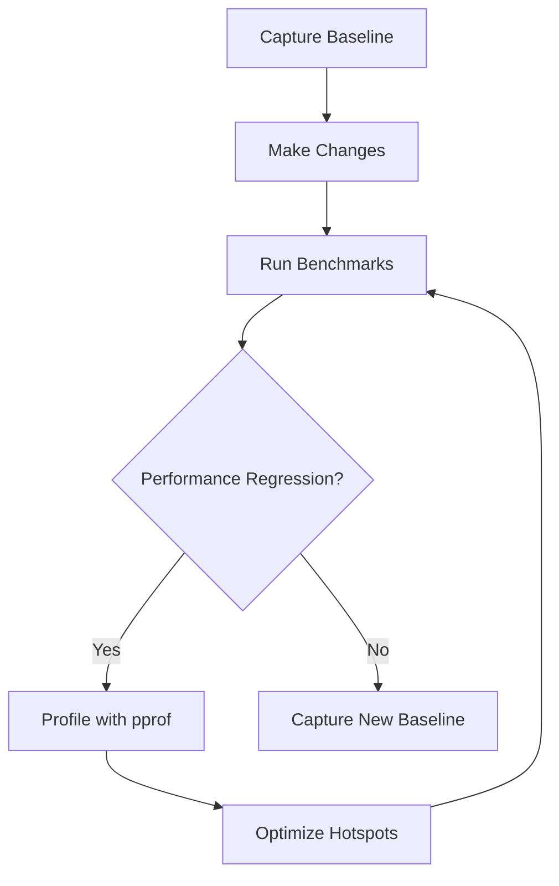

# Profiling and Performance Monitoring Guide

This guide covers profiling, benchmarking, and memory leak detection for the North Cloud monorepo.

## Table of Contents

1. [Overview](#overview)
2. [Quick Start](#quick-start)
3. [pprof Profiling](#pprof-profiling)
4. [Benchmarking](#benchmarking)
5. [Memory Monitoring](#memory-monitoring)
6. [Memory Leak Detection](#memory-leak-detection)
7. [Helper Scripts](#helper-scripts)
8. [Best Practices](#best-practices)

---

## Overview

North Cloud includes comprehensive profiling infrastructure across all 6 Go services:

- **pprof profiling**: CPU, memory, goroutine, and block profiling
- **Benchmarking**: 44 benchmark tests with baseline tracking
- **Memory monitoring**: Real-time memory health endpoints
- **Automated leak detection**: Baseline comparison and alerting

### Services Covered

- **Crawler** (port 6060) - Web crawling and job scheduling
- **Source Manager** (port 6061) - Source configuration management
- **Classifier** (port 6062) - Content classification and quality scoring
- **Publisher** (port 6063/6064) - Article routing and Redis pub/sub
- **Auth** (port 6065) - Authentication and JWT management
- **Search** (port 6066) - Full-text search across content

---

## Quick Start

### 1. Enable Profiling

Edit `.env` file:

```bash
ENABLE_PROFILING=true
```

### 2. Start Services

```bash
docker-compose -f docker-compose.base.yml -f docker-compose.dev.yml up -d
```

### 3. Capture Profiles

```bash
# Heap profile (crawler service)
curl http://localhost:6060/debug/pprof/heap > heap.pprof

# CPU profile (30 seconds)
curl "http://localhost:6060/debug/pprof/profile?seconds=30" > cpu.pprof

# View in browser
go tool pprof -http=:8081 heap.pprof
```

### 4. Run Benchmarks

```bash
cd crawler
task bench:baseline  # Capture baseline
task bench           # Run benchmarks
```

### 5. Check Memory Health

```bash
curl http://localhost:6060/health/memory
```

---

## pprof Profiling

### Available Profiles

Each service exposes the following profiles at `http://localhost:{PORT}/debug/pprof/`:

| Profile | Description | Usage |
|---------|-------------|-------|
| `/heap` | Memory allocation | Find memory leaks |
| `/profile` | CPU profile | Find CPU hotspots |
| `/goroutine` | Goroutine stack traces | Find goroutine leaks |
| `/allocs` | All memory allocations | Memory allocation patterns |
| `/block` | Blocking operations | Find contention |
| `/mutex` | Mutex contention | Lock contention analysis |

### Capturing Profiles

#### Heap Profile

```bash
# Current heap allocation
curl http://localhost:6060/debug/pprof/heap > heap.pprof

# All allocations (including freed)
curl http://localhost:6060/debug/pprof/allocs > allocs.pprof
```

#### CPU Profile

```bash
# Profile for 30 seconds
curl "http://localhost:6060/debug/pprof/profile?seconds=30" > cpu.pprof

# Profile for 60 seconds
curl "http://localhost:6060/debug/pprof/profile?seconds=60" > cpu.pprof
```

#### Goroutine Profile

```bash
curl http://localhost:6060/debug/pprof/goroutine > goroutine.pprof
```

### Analyzing Profiles

#### Interactive Terminal

```bash
go tool pprof heap.pprof
(pprof) top10      # Show top 10 allocations
(pprof) list main  # Show source code for main
(pprof) web        # Generate graph (requires graphviz)
```

#### Web Interface

```bash
# Best for visualization
go tool pprof -http=:8081 heap.pprof
```

Open http://localhost:8081 to see:
- Flame graphs
- Top allocations
- Source code view
- Call graphs

#### Compare Profiles

```bash
# Compare heap before and after
go tool pprof -http=:8081 -base=heap-before.pprof heap-after.pprof
```

### Service-Specific Ports

```bash
# Crawler
curl http://localhost:6060/debug/pprof/heap > profiles/crawler-heap.pprof

# Classifier
curl http://localhost:6062/debug/pprof/heap > profiles/classifier-heap.pprof

# Publisher API
curl http://localhost:6063/debug/pprof/heap > profiles/publisher-api-heap.pprof

# Publisher Router
curl http://localhost:6064/debug/pprof/heap > profiles/publisher-router-heap.pprof

# Search
curl http://localhost:6066/debug/pprof/heap > profiles/search-heap.pprof

# Source Manager
curl http://localhost:6061/debug/pprof/heap > profiles/source-manager-heap.pprof

# Auth
curl http://localhost:6065/debug/pprof/heap > profiles/auth-heap.pprof
```

---

## Benchmarking

### Running Benchmarks

Each service has 4 benchmark tasks:

```bash
cd {service}

# Run all benchmarks
task bench

# Capture baseline (30s benchtime, 5 iterations)
task bench:baseline

# Compare to baseline (requires benchstat)
task bench:compare

# Run with profiling
task bench:profile
```

### Benchmark Coverage

**Total: 44 benchmarks across 6 services**

#### Crawler (18 benchmarks)
- `BenchmarkExtractRawContent` - HTML parsing and extraction
- `BenchmarkParseHTML` - goquery HTML parsing
- `BenchmarkExtractMetadata` - OG tag and meta tag extraction
- `BenchmarkTextExtraction` - Text content extraction
- `BenchmarkRawContentValidation` - Content validation
- `BenchmarkJobScheduling` - Job filtering and scheduling
- `BenchmarkLockAcquisition` - Distributed lock logic
- `BenchmarkNextRunCalculation` - Interval calculation
- `BenchmarkExponentialBackoff` - Retry backoff
- `BenchmarkJobStatusTransition` - State machine validation
- `BenchmarkMetricsCollection` - Thread-safe metrics
- `BenchmarkJobExecutionHistory` - Execution record creation
- `BenchmarkJSONMarshaling` - JSON serialization for ES
- `BenchmarkIndexDocumentPreparation` - Bulk index prep
- `BenchmarkIndexNameGeneration` - Index name generation
- `BenchmarkQueryBuilding` - Elasticsearch query building
- `BenchmarkURLNormalization` - URL normalization

#### Classifier (6 benchmarks)
- `BenchmarkCrimeDetection` - Crime keyword detection
- `BenchmarkQualityScoring` - Quality score calculation
- `BenchmarkContentTypeDetection` - Content type classification
- `BenchmarkTopicClassification` - Topic detection
- `BenchmarkFullClassification` - Complete pipeline
- `BenchmarkSourceReputationCalculation` - Reputation scoring

#### Publisher (6 benchmarks)
- `BenchmarkArticleFiltering` - Route filtering logic
- `BenchmarkRedisMessageSerialization` - JSON for pub/sub
- `BenchmarkRouteProcessing` - Complete route processing
- `BenchmarkTopicMatching` - Topic matching
- `BenchmarkPublishHistoryCheck` - Deduplication check
- `BenchmarkBatchProcessing` - Batch article processing

#### Search (7 benchmarks)
- `BenchmarkFullTextSearch` - Multi-field search queries
- `BenchmarkFacetedSearch` - Filtered search with aggregations
- `BenchmarkSearchHighlighting` - Result highlighting
- `BenchmarkResultSorting` - Sort logic
- `BenchmarkPagination` - Pagination calculation
- `BenchmarkDateRangeFilter` - Date filtering
- `BenchmarkQueryParsing` - Query parsing

#### Source Manager (7 benchmarks)
- `BenchmarkSourceCRUD` - CRUD operations
- `BenchmarkSourceValidation` - Configuration validation
- `BenchmarkTestCrawl` - Test crawl simulation
- `BenchmarkSelectorMatching` - CSS selector matching
- `BenchmarkMetadataExtraction` - Metadata extraction
- `BenchmarkSourceListing` - Listing and filtering
- `BenchmarkURLParsing` - URL validation

#### Auth (10 benchmarks)
- `BenchmarkJWTGeneration` - JWT token generation
- `BenchmarkJWTValidation` - Token validation
- `BenchmarkPasswordValidation` - Password checking
- `BenchmarkTokenExpiration` - Expiration checking
- `BenchmarkHMACSignature` - HMAC-SHA256 signing
- `BenchmarkBase64Encoding` - Base64 URL encoding
- `BenchmarkBase64Decoding` - Base64 URL decoding
- `BenchmarkJSONMarshalClaims` - Claims marshaling
- `BenchmarkJSONUnmarshalClaims` - Claims unmarshaling
- `BenchmarkTokenParsing` - Token string parsing

### Installing benchstat

```bash
go install golang.org/x/perf/cmd/benchstat@latest
```

### Interpreting Results

```
BenchmarkExtractRawContent-8    10000    123456 ns/op    45678 B/op    123 allocs/op
                         │       │        │               │             │
                         │       │        │               │             └─ Allocations per operation
                         │       │        │               └─ Bytes allocated per operation
                         │       │        └─ Nanoseconds per operation
                         │       └─ Number of iterations
                         └─ GOMAXPROCS value
```

### Baseline Comparison

```bash
# Capture baseline
task bench:baseline
# Output: benchmarks/baseline-2026-01-04.txt

# Make changes to code...

# Compare
task bench:compare
```

Example output:
```
name                old time/op  new time/op  delta
ExtractRawContent   123µs ± 2%   115µs ± 1%  -6.50%
JSONMarshaling      45.6µs ± 1%  43.2µs ± 2%  -5.26%

name                old alloc/op  new alloc/op  delta
ExtractRawContent   45.6kB ± 0%   42.3kB ± 0%  -7.24%
```

---

## Memory Monitoring

### Memory Health Endpoints

All services expose `/health/memory` endpoint:

```bash
curl http://localhost:6060/health/memory | jq
```

Response:
```json
{
  "timestamp": "2026-01-04T10:30:00Z",
  "heap_alloc_mb": 12.5,
  "heap_inuse_mb": 15.2,
  "heap_idle_mb": 8.3,
  "stack_inuse_mb": 1.2,
  "num_gc": 42,
  "num_goroutine": 127,
  "gomaxprocs": 8,
  "last_gc_pause_ms": 0.5
}
```

### Metrics Explained

- **heap_alloc_mb**: Currently allocated heap memory
- **heap_inuse_mb**: Heap memory in use (including free chunks)
- **heap_idle_mb**: Heap memory returned to OS
- **stack_inuse_mb**: Stack memory in use
- **num_gc**: Number of completed GC cycles
- **num_goroutine**: Current goroutine count
- **gomaxprocs**: Maximum OS threads (auto-detected in containers)
- **last_gc_pause_ms**: Last GC pause duration

### Monitoring All Services

```bash
#!/bin/bash
# Check memory across all services

for port in 6060 6061 6062 6063 6064 6065 6066; do
  service=$(case $port in
    6060) echo "Crawler" ;;
    6061) echo "Source Manager" ;;
    6062) echo "Classifier" ;;
    6063) echo "Publisher API" ;;
    6064) echo "Publisher Router" ;;
    6065) echo "Auth" ;;
    6066) echo "Search" ;;
  esac)

  echo "=== $service (port $port) ==="
  curl -s http://localhost:$port/health/memory | jq '{heap_alloc_mb, num_goroutine, num_gc}'
  echo
done
```

---

## Memory Leak Detection

### Manual Leak Detection

#### 1. Establish Baseline

```bash
# Start service
docker-compose up -d crawler

# Wait for warmup (2-5 minutes)
sleep 300

# Capture baseline
curl http://localhost:6060/debug/pprof/heap > baseline-heap.pprof
```

#### 2. Run Load Test

```bash
# Generate load (use your load testing tool)
# ... run for 30-60 minutes ...
```

#### 3. Compare Profiles

```bash
# Capture after load
curl http://localhost:6060/debug/pprof/heap > after-load-heap.pprof

# Compare
go tool pprof -http=:8081 -base=baseline-heap.pprof after-load-heap.pprof
```

Look for:
- **Steady growth**: Objects that continuously increase
- **Large allocations**: Functions allocating significant memory
- **Retained objects**: Objects that should be freed but aren't

### Goroutine Leak Detection

```bash
# Baseline
curl http://localhost:6060/debug/pprof/goroutine > baseline-goroutine.pprof

# After load
curl http://localhost:6060/debug/pprof/goroutine > after-goroutine.pprof

# Compare
go tool pprof -http=:8081 -base=baseline-goroutine.pprof after-goroutine.pprof
```

Signs of goroutine leak:
- Goroutine count continuously increasing
- Goroutines blocked forever
- Channel send/receive without corresponding receive/send

### Automated Leak Detection

Use the helper script (see [Helper Scripts](#helper-scripts)):

```bash
./scripts/check-memory-leaks.sh crawler 6060
```

---

## Helper Scripts

### Available Scripts

Located in `/scripts/` directory:

1. **profile.sh** - Automated profile capture
2. **compare-heap.sh** - Memory leak detection
3. **run-benchmarks.sh** - Run benchmarks across all services
4. **check-memory-leaks.sh** - Automated leak checking

### Usage Examples

#### Capture Profiles for All Services

```bash
./scripts/profile.sh --all --type heap
./scripts/profile.sh --all --type cpu --duration 60
```

#### Detect Memory Leaks

```bash
# Capture baseline, wait, then compare
./scripts/compare-heap.sh crawler 6060 --interval 1800
```

#### Run All Benchmarks

```bash
# Run benchmarks for all services
./scripts/run-benchmarks.sh

# Capture baselines for all services
./scripts/run-benchmarks.sh --baseline

# Compare all services to baseline
./scripts/run-benchmarks.sh --compare
```

---

## Best Practices

### Development

1. **Capture baseline early**: Before making changes
2. **Profile before optimizing**: Measure first, optimize second
3. **Use benchmarks for regressions**: Add benchmarks for critical paths
4. **Monitor memory regularly**: Check `/health/memory` during development

### Production

1. **Disable pprof in production**: Set `ENABLE_PROFILING=false`
2. **Use Pyroscope for continuous profiling**: <2% overhead (Phase 5)
3. **Set up alerts**: Monitor goroutine count and heap allocation
4. **Establish baselines**: Capture profiles after deployment

### Profiling Workflow



### Memory Leak Investigation

1. **Reproduce**: Ensure leak is reproducible
2. **Baseline**: Capture heap profile after warmup
3. **Load test**: Run realistic load for 30-60 minutes
4. **Compare**: Use `pprof -base` to compare profiles
5. **Identify**: Look for steady growth in specific allocations
6. **Fix**: Address the leak
7. **Verify**: Repeat test to confirm fix

### Benchmark Best Practices

- **Run multiple iterations**: Use `-benchtime=30s -count=5`
- **Disable CPU throttling**: Ensure consistent environment
- **Minimize background tasks**: Close unnecessary applications
- **Use benchstat**: Statistical comparison is more reliable
- **Track baselines**: Commit baseline files to git

---

## Troubleshooting

### pprof Not Accessible

**Problem**: Cannot access http://localhost:6060/debug/pprof/

**Solutions**:
1. Check `ENABLE_PROFILING=true` in `.env`
2. Verify service is running: `docker ps`
3. Check port mapping: `docker port north-cloud-crawler`
4. Verify profiling import in service code

### High Memory Usage

**Problem**: Service consuming excessive memory

**Investigation**:
```bash
# Check current allocation
curl http://localhost:6060/health/memory

# Capture heap profile
curl http://localhost:6060/debug/pprof/heap > heap.pprof

# Analyze
go tool pprof -http=:8081 heap.pprof
```

Look for:
- Large allocations in specific functions
- Memory not being freed (retained objects)
- Growing allocations over time

### Goroutine Leaks

**Problem**: Goroutine count continuously increasing

**Investigation**:
```bash
# Check goroutine count
curl http://localhost:6060/health/memory | jq .num_goroutine

# Capture goroutine profile
curl http://localhost:6060/debug/pprof/goroutine > goroutine.pprof

# Analyze
go tool pprof -http=:8081 goroutine.pprof
```

Common causes:
- Channels without receivers
- Blocking operations without timeouts
- Missing context cancellation

### Benchmark Variance

**Problem**: Benchmark results vary significantly

**Solutions**:
- Use longer benchtime: `-benchtime=30s` or `-benchtime=60s`
- Run multiple times: `-count=10`
- Use benchstat for statistical analysis
- Disable CPU frequency scaling
- Close background applications

---

## Additional Resources

### Go Profiling

- [Go pprof Documentation](https://pkg.go.dev/net/http/pprof)
- [Profiling Go Programs](https://go.dev/blog/pprof)
- [Diagnostics Guide](https://go.dev/doc/diagnostics)

### Benchmarking

- [Go Benchmark Documentation](https://pkg.go.dev/testing#hdr-Benchmarks)
- [benchstat Documentation](https://pkg.go.dev/golang.org/x/perf/cmd/benchstat)

### Memory Management

- [Go Memory Management](https://go.dev/doc/gc-guide)
- [Understanding Allocations](https://segment.com/blog/allocation-efficiency-in-high-performance-go-services/)

---

## Next Steps

1. **Phase 5**: Implement Pyroscope continuous profiling
2. **Alerting**: Set up monitoring alerts for memory/goroutine thresholds
3. **Automation**: Integrate benchmark comparisons into CI/CD
4. **Documentation**: Add service-specific profiling guides

---

*Generated with Claude Code - Last updated: 2026-01-04*
