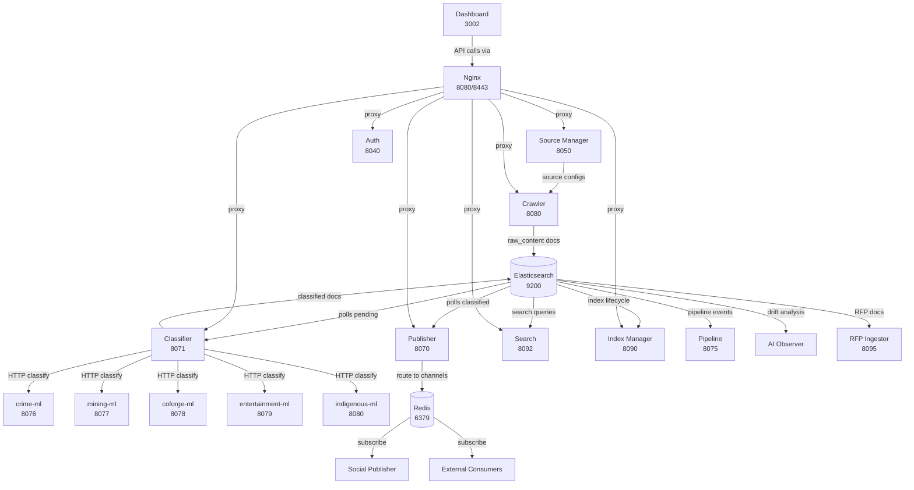

# Service Dependencies

How NorthCloud services communicate with each other and shared infrastructure.

---

## Data Flow Diagram

## Service Communication Matrix

### HTTP Calls (service-to-service)

| Source | Target | Endpoint Pattern | Purpose |
|--------|--------|-----------------|---------|
| Crawler | Source Manager | `GET /api/v1/sources` | Fetch source configurations |
| Classifier | crime-ml | `POST /classify` | Crime relevance classification |
| Classifier | mining-ml | `POST /classify` | Mining relevance classification |
| Classifier | coforge-ml | `POST /classify` | Coforge relevance classification |
| Classifier | entertainment-ml | `POST /classify` | Entertainment classification |
| Classifier | indigenous-ml | `POST /classify` | Indigenous classification |
| Dashboard | All backends | Various `/api/v1/*` | Proxied via Nginx |

### Elasticsearch (reads/writes)

| Service | Index Pattern | Operation | Purpose |
|---------|--------------|-----------|---------|
| Crawler | `{source}_raw_content` | Write | Index crawled content |
| Classifier | `{source}_raw_content` | Read | Poll pending documents |
| Classifier | `{source}_classified_content` | Write | Index classified content |
| Publisher | `*_classified_content` | Read | Poll for routing |
| Search | `*_classified_content` | Read | Full-text search queries |
| Index Manager | `*_raw_content`, `*_classified_content` | Read/Write | Index lifecycle management |
| Pipeline | `pipeline_events` | Read/Write | Pipeline event tracking |
| AI Observer | `*_classified_content` | Read | Classifier drift analysis |
| RFP Ingestor | `rfp_classified_content` | Write | Index RFP documents |

### Redis (Pub/Sub)

| Service | Role | Channel Pattern | Purpose |
|---------|------|----------------|---------|
| Publisher | Publish | `content:*`, `crime:*`, `mining:*`, `entertainment:*`, `indigenous:*`, `coforge:*` | Route classified content |
| Social Publisher | Subscribe | Configured channels | Consume for social media posting |
| External consumers | Subscribe | Any channel | Consume routed content |
| Source Manager | Publish | `source:events` | Source enable/disable events |
| Crawler | Subscribe | `source:events` | React to source changes |

### PostgreSQL (per-service databases)

| Service | Database | Key Tables |
|---------|----------|-----------|
| Crawler | postgres-crawler | jobs, frontier_urls, feed_states |
| Classifier | postgres-classifier | classification_runs |
| Publisher | postgres-publisher | channels, publish_history, routing_cursors |
| Source Manager | postgres-source-manager | sources |
| Index Manager | postgres-index-manager | index_metadata |
| Pipeline | postgres-pipeline | pipeline_events (partitioned monthly) |
| Click Tracker | postgres-click-tracker | click_events |
| Social Publisher | postgres-social-publisher | social_posts, platform_configs |

### No Database

| Service | Storage |
|---------|---------|
| Auth | Stateless (JWT signing only) |
| Search | Elasticsearch only |
| AI Observer | Elasticsearch only |
| RFP Ingestor | Elasticsearch only |
| MCP Server | Proxies to other services |
| nc-http-proxy | In-memory replay |
| Dashboard | Frontend only |

## Dependency Rule

**Services import only from `infrastructure/`.** No cross-service imports are permitted. Services communicate exclusively via HTTP, Elasticsearch, Redis, or PostgreSQL.
