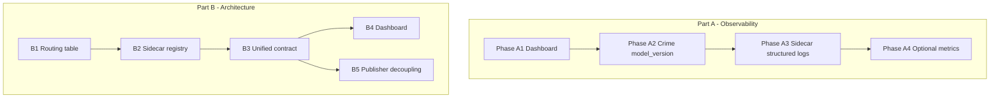

# ML Sidecars Observability + Classifier Architecture Overhaul

**Date**: 2026-02-20  
**Status**: Draft  
**Supersedes**: ML Sidecars observability overhaul plan (observability track retained); adds classifier routing/registry/contract and publisher decoupling.

This plan has two tracks:

1. **Observability** — Dashboard clarity, crime model_version, sidecar structured logging, optional metrics/SLOs. Correctly scoped; does not fix pipeline debt.
2. **Architecture** — Replace "articles + crime as primary" with a taxonomy-agnostic pipeline: declarative routing table, sidecar registry, unified sidecar contract, and publisher that reads generic ML results.

Do the observability work in parallel or first. Do the architecture work **before** expanding into jobs/recipes so that adding taxonomies does not require touching classifier or publisher logic.

---

## Validation of the architect’s read (corrections / nuances)

- **“Content type does not determine which ML models run”** — The goal is that the **mapping** from content type to which models run is **config-driven**, not that content type is irrelevant. For recipes you still want e.g. `recipe` → `[recipe-ml]`. The fix is a declarative routing table (content_type → list of sidecar keys), not removing the link.
- **“Generic ML results table”** — Today ML results are fixed fields on `ClassifiedContent` and `Article` (crime, mining, coforge, …). “Generic” here means: store ML results in a **shape that can grow without schema change** (e.g. a single `ml_results` map or JSON object keyed by taxonomy), and have publishing **iterate over whatever keys exist** instead of hardcoded crime/mining/coforge checks. No separate DB table is required; ES doc shape and publisher payload can stay document-centric.
- **Location** — Location is an in-process, content-based classifier, not an HTTP sidecar. The routing table can still list “location” for event content; the implementation may resolve “location” to an in-process call rather than a registry URL. The plan treats “optional classifiers” as a mix of sidecars (HTTP) and in-process (location); registry/routing can reflect that.
- **Domain** — `ClassificationResult` already has `ContentType` with comment including `"job"` ([classification.go](classifier/internal/domain/classification.go)); the domain anticipates job. The debt is in **gating and wiring**, not the content type enum.

Everything else in the architect’s read matches the codebase: content-type-driven gating in `classifyOptionalForPublishable`, hardcoded sidecar clients in bootstrap and `runOptionalClassifiers`, differing response shapes and crime’s missing model_version, publisher layers and payload keys per taxonomy.

---

## Part A: Observability (unchanged scope)

Observability is **not** the root cause of “only crime has logs”; traffic and gating are. The observability plan remains:

- **Phase A1 — Dashboard only**: Add unified “ML activity” log panel (classifier logs for all sidecars), short description of why per-sidecar streams are mostly health, optional “Traffic by sidecar” panel; optionally replace five log streams with one combined sidecar stdout panel.
- **Phase A2 — Crime model_version**: Add `model_version` to crime-ml’s classify response and to [classifier/internal/mlclient/client.go](classifier/internal/mlclient/client.go); pass through to `logSidecarSuccess` for crime-ml.
- **Phase A3 — Sidecar structured logging**: One JSON log line per `POST /classify` in each sidecar (msg, path, latency_ms, model_version, relevance/top label, optional request_id); same `service` label in Loki.
- **Phase A4 — Optional**: Prometheus `/metrics` per sidecar, Alloy scrape, SLO-style panels and alerts.

Files: [north-cloud-ml-sidecars.json](infrastructure/grafana/provisioning/dashboards/north-cloud-ml-sidecars.json), [ml-sidecars/crime-ml/main.py](ml-sidecars/crime-ml/main.py), [classifier/internal/mlclient/client.go](classifier/internal/mlclient/client.go), each `ml-sidecars/<name>/main.py`, Alloy, alerts.

---

## Part B: Architecture — Taxonomy-agnostic pipeline

### B1. Declarative routing table (content_type → sidecars)

**Current**: [classifier/internal/classifier/classifier.go](classifier/internal/classifier/classifier.go) — `classifyOptionalForPublishable` branches on content type/subtype and calls `runCrimeOnly`, `runLocationOnly`, or `runOptionalClassifiers` (all five).

**Target**: Config-driven mapping, e.g. YAML or env-backed config:

```yaml
routing:
  article:        # and article-like subtypes
    - crime
    - mining
    - coforge
    - entertainment
    - anishinaabe
    - location
  blotter:
    - crime
  event:
    - location
  report: []
  job:
    - job-ml
  recipe:
    - recipe-ml
```

Classifier logic becomes: `sidecarsToCall = routing[contentType]` (with subtype handling for article vs blotter/event/report if kept in config). Adding jobs or recipes = add a row; no code change.

**Files**: New config struct and loader (e.g. under [classifier/internal/config](classifier/internal/config)); classifier orchestration reads routing and calls only the listed sidecars (see B2).

---

### B2. Sidecar registry (name → url, enabled)

**Current**: [classifier/internal/config/config.go](classifier/internal/config/config.go) has per-sidecar `Enabled` + `MLServiceURL` (CRIME_ENABLED, CRIME_ML_SERVICE_URL, …). [classifier/internal/bootstrap/classifier.go](classifier/internal/bootstrap/classifier.go) builds a fixed `classifier.Config` with pointers to crime, mining, coforge, entertainment, anishinaabe clients.

**Target**: A single **registry** (config or YAML), e.g.:

```yaml
sidecars:
  crime:        { url: "http://crime-ml:8076",  enabled: true }
  mining:       { url: "http://mining-ml:8077", enabled: true }
  coforge:      { url: "http://coforge-ml:8078", enabled: true }
  entertainment: { url: "http://entertainment-ml:8079", enabled: true }
  anishinaabe:  { url: "http://anishinaabe-ml:8080", enabled: true }
  location:     { in_process: true }   # or url: "" and special handling
  job:          { url: "http://job-ml:8081", enabled: true }
  recipe:       { url: "http://recipe-ml:8082", enabled: false }
```

Classifier loads registry + routing table; for each key in `routing[contentType]`, looks up URL (or in-process) and invokes. No hardcoded “crime”, “mining” in the orchestration loop. Existing env vars can be retained as the source of registry data (e.g. one env per sidecar) or replaced by a single config file.

**Files**: Config/registry loader; refactor [classifier/internal/classifier](classifier/internal/classifier) to hold a map of sidecar clients (or a generic “call sidecar by key” abstraction) instead of separate `c.crime`, `c.mining`, etc. Location can remain a special case (in-process) in the registry.

---

### B3. Unified classifier ↔ sidecar contract

**Current**: Each sidecar has a different response shape (CrimeResult, MiningResult, …); crime-ml does not return `model_version` in the classify response; each client has its own unmarshalling and mapping into domain types.

**Target**: A **minimal shared contract** that every sidecar must satisfy (and that the classifier uses for observability and routing):

- `model_version` (string)
- Primary label/relevance (e.g. `relevance` or first of `labels`)
- `confidence` (float)
- `latency_ms` or equivalent (or measured by classifier)
- `error` (null or `{ type, message }`) for failures

Domain-specific fields (crime_types, commodities, categories, …) can remain in extended response shapes, but the **orchestrator** and **observability** rely only on the shared subset. This implies:

- Crime-ml (and any other) classify response includes `model_version`.
- Classifier either: (a) uses a single generic “sidecar response” type for logging and then maps to domain types per key, or (b) keeps domain types but ensures they all expose the shared fields (model_version, relevance, confidence, latency, error). Option (b) is closer to current code and easier to adopt incrementally.

**Files**: [ml-sidecars/*/main.py](ml-sidecars/crime-ml/main.py) response models; [classifier/internal/mlclient](classifier/internal/mlclient) and other sidecar clients; [classifier/internal/domain/classification.go](classifier/internal/domain/classification.go) (ensure all result types have the shared fields). Optional: define a shared `SidecarResponse` interface or struct used by the registry-based invoker.

---

### B4. Dashboard taxonomy-agnostic

Once routing and registry are config-driven, the dashboard already “by sidecar” (activity, errors, latency) is taxonomy-agnostic. Add:

- “Traffic by sidecar” (from classifier logs).
- “Traffic by content type” (optional; requires classifier to log content_type alongside sidecar, which it already does).

No “crime is the only one with logs” — the narrative is “which sidecars were invoked in this time range,” driven by routing + traffic.

**Files**: [north-cloud-ml-sidecars.json](infrastructure/grafana/provisioning/dashboards/north-cloud-ml-sidecars.json) (panels and descriptions). Part A1 covers the main UX improvements.

---

### B5. Publisher: decouple ML results from content type

**Current**: [publisher/internal/router](publisher/internal/router) has fixed layers (Layer 3 = crime, Layer 5 = mining, …) and [Article](publisher/internal/router/article.go) has explicit `Crime`, `Mining`, `Coforge`, `Entertainment`, `Anishinaabe`. [publishToChannel](publisher/internal/router/service.go) builds a payload with explicit keys (`crime_relevance`, `mining`, `anishinaabe`, …). Adding a new taxonomy = new domain file, new Article fields, new payload keys.

**Target** (minimal, principled):

- **Storage (classifier → ES)**: Prefer a single **generic ML results** shape that the classifier writes: e.g. `ml_results: { "crime": {...}, "mining": {...}, "job": {...} }` or an equivalent that allows new keys without changing the top-level schema. This may mean adding `ml_results map[string]any` (or a typed map) to `ClassifiedContent` and still writing the current fixed fields for backward compatibility during migration; or migrating to only `ml_results` and updating publisher/consumers once.
- **Publisher**:
  - Either: keep current structure for existing taxonomies and add a **generic path**: for any key in `ml_results` (or in a configurable list), run a generic “ML domain” router that produces channels based on a small per-taxonomy config (e.g. channel prefix, relevance field name).
  - Or: refactor routing to be **registry-driven** — a list of “ML domains” with name, relevance field, channel prefix, skip value (e.g. `not_crime`, `not_mining`). Each domain’s layer reads from the same generic `ml_results[domain]` (or current nested field during transition) and publishes without new code for new taxonomies.

Adding jobs/recipes then becomes: add to classifier routing + registry, add to ES shape (if not already generic), add one config entry for the new domain in the publisher; no new router files or payload keys if the generic path is used.

**Files**: [classifier/internal/domain/classification.go](classifier/internal/domain/classification.go) (optional `ml_results` or migration); ES mapping for classified_content; [publisher/internal/router](publisher/internal/router) — generic ML domain layer and config; [Article](publisher/internal/router/article.go) and payload construction in [service.go](publisher/internal/router/service.go).

---

## Implementation order



- **Part A** can start immediately and is independent of Part B.
- **Part B** order: B1 (routing table) first so the classifier’s “which sidecars to call” is data-driven. Then B2 (registry) so “how to call them” is data-driven. Then B3 (unified contract) so observability and future sidecars are stable. B4 (dashboard) is mostly done in A1; B5 (publisher) can follow B3 so that when you add job/recipe, both classifier and publisher are already generic.

---

## Summary

| Track | What | Why |
|-------|------|-----|
| **A. Observability** | Dashboard clarity, crime model_version, sidecar JSON logs, optional metrics | Industry-standard visibility without changing pipeline logic. |
| **B. Architecture** | Routing table, sidecar registry, unified contract, taxonomy-agnostic publisher | Unbake “articles + crime as primary”; adding jobs/recipes = config, not code. |

The architect’s read is correct: observability is solid and scoped; the real debt is the classifier’s routing model and the publisher’s hardcoded taxonomy layers. This plan keeps the observability work and adds the minimal foundational changes (B1–B5) so that scaling into jobs, recipes, and future taxonomies does not require touching classifier or publisher logic.
