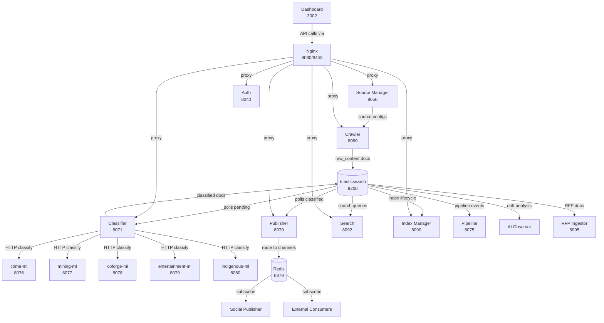

# M0: Architecture Review & Versioning — Implementation Plan

> **For Claude:** REQUIRED SUB-SKILL: Use superpowers:executing-plans to implement this plan task-by-task.

**Goal:** Codify NorthCloud's current architecture into a versioned, governed platform.

**Architecture:** M0 is a documentation and governance milestone. No application code changes except Task 5 (module path cleanup). Tasks 1, 2, 4, 6 create new files. Task 3 audits and updates existing specs. Task 5 is a cross-service refactor of Go module import paths.

**Tech Stack:** Markdown, Go modules, GitHub CLI (`gh`), git

---

## Pre-Flight

**GitHub milestones and labels are already created** (done in brainstorming session 2026-03-08). Issues #163-#168 exist for M0.

**What remains:**
- Task 1: VERSION + CHANGELOG
- Task 2: ROADMAP.md
- Task 3: Spec drift audit & fix (largest task)
- Task 4: Issue templates + issue migration (milestones/labels done)
- Task 5: Module path cleanup (only code change)
- Task 6: Service dependency map

---

### Task 1: Platform Version & CHANGELOG

**GitHub Issue:** #163

**Files:**
- Create: `VERSION`
- Create: `CHANGELOG.md`
- Modify: `ARCHITECTURE.md` (add versioning strategy section)

**Step 1: Create VERSION file**

```
0.5.0
```

Write this to `VERSION` at repo root. Single line, no trailing newline.

**Step 2: Create CHANGELOG.md**

Use [keepachangelog](https://keepachangelog.com/) format. Backfill from git history. Key changes to include:

```markdown
# Changelog

All notable changes to NorthCloud are documented in this file.

Format follows [Keep a Changelog](https://keepachangelog.com/en/1.1.0/).
This project uses [Semantic Versioning](https://semver.org/).

## [Unreleased]

### Added
- M0 and M1 milestone design documents
- GitHub milestones (M0-M4), service labels, and governance structure

## [0.5.0] - 2026-03-08

### Added
- AI Observer service for classifier drift detection
- Grafana dashboard for AI Insights
- Prometheus metrics and pipeline dashboard for publisher
- Contract test job in CI pipeline
- v1 contract schemas for Redis messages, search API, and channels
- MCP fetch_url tool with schema extraction and JS renderer
- Playwright renderer added to CI build pipeline

### Fixed
- AI Observer: read source_name instead of non-existent domain field
- AI Observer: strip markdown fences from LLM JSON response
- AI Observer: use flattened ES mapping for details field
- Deploy: force-recreate Grafana on infrastructure changes
- Deploy: route Redis through compose network
- Security: bind Redis and Postgres-crawler to 127.0.0.1 only

## [0.4.0] - 2026-02-16

### Added
- Indigenous ML sidecar and Layer 7 Indigenous routing in publisher
- Mining ML sidecar and Layer 5 mining routing in publisher
- Entertainment ML sidecar and Layer 6 entertainment routing
- Coforge ML sidecar and Layer 8 coforge routing
- Source name sanitization extracted into infrastructure/naming package
- MCP audit logging, rate limiting, health check, error sanitization

### Fixed
- Classifier: skip <head> and <aside> in ExtractTextFromHTML
- RFP Ingestor: add explicit .keyword sub-field to content_type mapping
- RFP Ingestor: align ES mapping with search service expectations
- Search: parse topics[] array query param format
- Search: add human-readable label to facet buckets

## [0.3.0] - 2026-01-31

### Added
- Crawler: support unlimited crawl depth via max_depth: -1
- Classifier: event/recipe/job/obituary keyword heuristics + Schema.org Event detection
- Source Manager: Excel import improvements + internal tests
- Crawler: Colly features implementation
- Crawler: URL frontier for deduplication
- RFP Ingestor service (CanadaBuys CSV feed)
- Social Publisher service (Redis subscriber with priority queue)
- Click Tracker service

### Fixed
- Crawler: prevent fetcher from overwriting enriched raw content docs
- Classifier: fix ES index naming derivation + bulk response error parsing

## [0.2.0] - 2026-01-07

### Added
- Crime sub-category classification (violent, property, drug, organized, justice)
- Pipeline event service
- Database-backed publisher routing with 8 layers

### Changed
- Publisher modernization: database-backed Redis Pub/Sub routing hub
- Dashboard authentication: JWT-based auth with route guards

## [0.1.0] - 2025-12-23

### Added
- Raw content pipeline (raw → classify → publish)
- Crawler with interval-based job scheduler
- Classifier with hybrid rules+ML architecture
- Publisher with topic-based routing
- Source Manager with CSS selector configuration
- Search service with multi-index wildcard queries
- Dashboard (Vue.js 3)
- Auth service (JWT tokens)
- Index Manager for ES lifecycle
- Infrastructure shared packages (config, logger, ES client, Redis, JWT)
```

**Step 3: Add versioning strategy to ARCHITECTURE.md**

Add this section after the Version History section at the bottom:

```markdown
## Versioning Strategy

NorthCloud uses [Semantic Versioning](https://semver.org/):

- **MAJOR**: Breaking API changes visible to consumers
- **MINOR**: New features, milestones, or capabilities
- **PATCH**: Bug fixes, documentation, non-breaking improvements

The platform version is stored in `VERSION` at the repo root. All services share the platform version — there is no per-service versioning.

Git tags follow the pattern `v{MAJOR}.{MINOR}.{PATCH}` (e.g., `v0.5.0`).

See [CHANGELOG.md](./CHANGELOG.md) for the full history of changes.
```

**Step 4: Commit**

```bash
git add VERSION CHANGELOG.md ARCHITECTURE.md
git commit -m "feat(governance): add platform version 0.5.0 and CHANGELOG"
```

---

### Task 2: Roadmap Document

**GitHub Issue:** #164

**Files:**
- Create: `docs/ROADMAP.md`

**Step 1: Create docs/ROADMAP.md**

```markdown
# NorthCloud Roadmap

Living document tracking the NorthCloud platform milestone sequence.
For historical design documents, see `docs/plans/`.

---

## Milestone Sequence

```
M0: Architecture Review     ← CURRENT
 ↓
M1: Smart Extraction
 ↓
M2: Dynamic Crawling
 ↓  (can run parallel with M2)
M3: Observability Hardening
 ↓
M4: Contract Formalization
 ↓
M5: Product Layer (v0.6+)
```

---

## M0: Architecture Review & Versioning

**Goal:** Codify the current architecture into a versioned, governed platform.

**Scope:**
- Platform version (VERSION file + CHANGELOG)
- Living roadmap (this document)
- Spec drift audit and fix across 8 subsystem specs
- GitHub governance (milestones, labels, issue templates)
- Go module path cleanup (consistency across 15 services)
- Service dependency map

**Success criteria:** Every spec verified against code. Platform has a version. Roadmap is documented.

**Size:** Small — documentation only (except module paths)

**Status:** In progress. Design: `docs/plans/2026-03-08-m0-architecture-review-design.md`

---

## M1: Smart Extraction

**Goal:** Make extraction page-type aware and source-aware, fixing 75% of broken sources.

**Scope:**
- URL pre-filter (skip PDFs, CDNs, off-domain, store pages)
- Page type classifier (article vs listing vs stub vs other)
- CMS template registry (Postmedia, Torstar, WordPress, Drupal, Village Media, Black Press)
- Enhanced generic extraction (text density heuristic + readability default)
- Extraction quality metrics and Grafana dashboard
- Real extraction test endpoint (replace mock test_source)
- Extraction regression suite
- Backfill and validation of top 20 worst sources

**Success criteria:** Word count > 0 for >= 60% of raw_content docs (up from current 25%).

**Dependencies:** M0 (architecture codified first)

**Size:** Large — 8 tasks across crawler and source-manager

**Status:** Designed. Design: `docs/plans/2026-03-08-m1-smart-extraction-design.md`

---

## M2: Dynamic Crawling

**Goal:** Enable crawling of JavaScript-rendered sites via headless browser.

**Scope:**
- Headless browser service (Playwright/Chrome CDP)
- Sandbox isolation per crawl
- Per-source dynamic config (wait-for selectors, scroll depth, cookie acceptance)
- Observability (render time, JS errors, crash rate)
- Fallback chain: dynamic → static → feed → AMP
- Integration with existing crawler routing

**Success criteria:** Successfully crawl and extract content from 5+ JS-rendered sources.

**Dependencies:** M0, M1 (or at least M1 design)

**Size:** Large — new service + infrastructure

**Status:** Placeholder. See GitHub milestone M2.

---

## M3: Observability Hardening

**Goal:** Define SLAs, build alerting, create incident runbooks.

**Scope:**
- SLA/SLO targets per service (uptime%, P99 latency, error rate)
- Alerting rules in Grafana
- Incident response runbooks for top 10 failure modes
- Post-deploy smoke tests in CI
- Backup/restore procedures

**Success criteria:** Every service has a defined SLO. Alerts fire within 5 minutes of SLO breach.

**Dependencies:** Can run parallel with M2

**Size:** Medium

**Status:** Not started

---

## M4: Contract Formalization

**Goal:** Machine-readable API contracts for all services.

**Scope:**
- OpenAPI 3.1 specs for all HTTP APIs
- API versioning strategy and deprecation policy
- Request tracing headers standard
- SDK generation (optional)

**Success criteria:** Every service has an OpenAPI spec. Breaking changes follow deprecation policy.

**Dependencies:** M0

**Size:** Large

**Status:** Not started

---

## M5: Product Layer (v0.6+)

**Goal:** User-facing features and search experience improvements.

**Scope:**
- GIS and community indexing (existing v0.6 milestone)
- Search UX improvements
- New content types
- People directory

**Dependencies:** M1 (extraction must work before adding more content types)

**Size:** Large

**Status:** Partially started (v0.6 GIS milestone exists with 7 issues)

---

## Historical Plans

Design documents in `docs/plans/` are historical records from past development sessions.
They are not actively maintained. For current planning, use this roadmap and the GitHub milestones.
```

**Step 2: Commit**

```bash
git add docs/ROADMAP.md
git commit -m "docs(governance): add living roadmap document"
```

---

### Task 3: Spec Drift Audit & Fix

**GitHub Issue:** #165

This is the largest M0 task. It requires reading each spec and comparing against current code.

**Files:**
- Modify: `docs/specs/content-acquisition.md`
- Modify: `docs/specs/classification.md`
- Modify: `docs/specs/content-routing.md`
- Modify: `docs/specs/discovery-querying.md`
- Modify: `docs/specs/shared-infrastructure.md`
- Modify: `docs/specs/mcp-server.md`
- Modify: `docs/specs/social-publisher.md`
- Modify: `docs/specs/rfp-ingestor.md`
- Create: `docs/specs/auth.md` (stub)
- Create: `docs/specs/pipeline.md` (stub)
- Create: `docs/specs/dashboard.md` (stub)
- Create: `docs/specs/click-tracker.md` (stub)
- Create: `docs/specs/ai-observer.md` (stub)

**Step 1: Audit each spec against code**

For each of the 8 existing specs:
1. Read the spec file
2. Read the corresponding service CLAUDE.md
3. Read key source files referenced in the spec
4. Identify discrepancies (code wins over docs)
5. Fix the spec
6. Add `> Last verified: 2026-03-08` as the first line after the title

**Parallelization strategy:** This task can be split across subagents — one per spec. Each subagent reads the spec, reads the code, identifies drift, and proposes fixes.

**Step 2: Create stub specs for undocumented services**

For each of: auth, pipeline, dashboard, click-tracker, ai-observer:
1. Read the service's CLAUDE.md
2. Create a minimal spec with: overview, API endpoints, data model, configuration
3. Add `> Last verified: 2026-03-08`

**Step 3: Commit**

```bash
git add docs/specs/
git commit -m "docs(specs): audit and fix spec drift, add stub specs for undocumented services"
```

---

### Task 4: GitHub Governance (Issue Templates + Migration)

**GitHub Issue:** #166

**Milestones and labels are already created.** Remaining work: issue templates and issue migration.

**Files:**
- Create: `.github/ISSUE_TEMPLATE/bug.md`
- Create: `.github/ISSUE_TEMPLATE/feature.md`
- Create: `.github/ISSUE_TEMPLATE/spec-update.md`

**Step 1: Create issue templates**

`.github/ISSUE_TEMPLATE/bug.md`:
```markdown
---
name: Bug Report
about: Report a bug in a NorthCloud service
labels: bug
---

## Service

Which service is affected? (e.g., crawler, classifier, publisher)

## Description

What happened?

## Expected Behavior

What should have happened?

## Steps to Reproduce

1.
2.
3.

## Environment

- Branch/commit:
- Docker or local:
- Relevant logs:
```

`.github/ISSUE_TEMPLATE/feature.md`:
```markdown
---
name: Feature Request
about: Propose a new feature or enhancement
labels: enhancement
---

## Service

Which service(s) will this affect?

## Description

What do you want to build?

## Motivation

Why is this needed? What problem does it solve?

## Acceptance Criteria

- [ ]
- [ ]
- [ ]

## Design Doc

Link to design document in `docs/plans/` if available:
```

`.github/ISSUE_TEMPLATE/spec-update.md`:
```markdown
---
name: Spec Update
about: Report or fix spec drift between documentation and code
labels: spec-drift
---

## Spec File

Which spec has drifted? (e.g., `docs/specs/content-routing.md`)

## What Changed in Code

Describe what the code does now that the spec doesn't reflect:

## Proposed Spec Fix

Describe what the spec should say:
```

**Step 2: Migrate existing open issues into milestones**

Run these commands to assign open issues to milestones:

```bash
# GIS issues (151-157) → keep in v0.6 milestone (milestone 1)
# Issue 158 (Grafana Alloy) → M3: Observability (milestone 5)
gh issue edit 158 --milestone "M3: Observability Hardening" --repo jonesrussell/north-cloud
# Issue 160 (ai-observer alerts) → M3: Observability (milestone 5)
gh issue edit 160 --milestone "M3: Observability Hardening" --repo jonesrussell/north-cloud
# Issue 131 (MCP fetch_url) — already closed
# Issue 132 (JS rendering) — already closed, superseded by M2 milestone
# Issue 133 (schema extraction) — already closed
```

**Step 3: Commit**

```bash
git add .github/ISSUE_TEMPLATE/
git commit -m "docs(governance): add GitHub issue templates for bugs, features, and spec updates"
```

---

### Task 5: Module Path Cleanup

**GitHub Issue:** #167

This is the only M0 task that changes application code. It requires a branch.

**Current state:**
- 13 services use `github.com/jonesrussell/north-cloud/{service}` (majority)
- `infrastructure` uses `github.com/north-cloud/infrastructure`
- `nc-http-proxy` uses `github.com/north-cloud/nc-http-proxy`
- ALL 13 services import infrastructure via `github.com/north-cloud/infrastructure` with `replace => ../infrastructure`

**Decision:** The canonical path should be `github.com/jonesrussell/north-cloud/{service}` since it matches the GitHub repo URL and is used by 13/15 modules. We need to rename infrastructure and nc-http-proxy.

**Step 1: Create branch**

```bash
git checkout -b claude/m0-module-path-cleanup
```

**Step 2: Rename infrastructure module**

In `infrastructure/go.mod`, change:
```
module github.com/north-cloud/infrastructure
```
to:
```
module github.com/jonesrussell/north-cloud/infrastructure
```

**Step 3: Rename nc-http-proxy module**

In `nc-http-proxy/go.mod`, change:
```
module github.com/north-cloud/nc-http-proxy
```
to:
```
module github.com/jonesrussell/north-cloud/nc-http-proxy
```

**Step 4: Update all service go.mod files**

For each of the 13 services that import infrastructure, update go.mod:
- Change `github.com/north-cloud/infrastructure` → `github.com/jonesrussell/north-cloud/infrastructure`
- Both in the `require` block and the `replace` directive

Services to update: ai-observer, auth, classifier, click-tracker, crawler, index-manager, mcp-north-cloud, pipeline, publisher, rfp-ingestor, search, social-publisher, source-manager

**Step 5: Update all Go import statements**

Find and replace across all `.go` files (excluding vendor/):
```
github.com/north-cloud/infrastructure → github.com/jonesrussell/north-cloud/infrastructure
github.com/north-cloud/nc-http-proxy → github.com/jonesrussell/north-cloud/nc-http-proxy
```

**Step 6: Update go.work**

No change needed — `go.work` uses relative paths (`./infrastructure`), not module paths.

**Step 7: Re-vendor all services**

```bash
task vendor
```

**Step 8: Run CI**

```bash
task ci:force
```

Expected: All linters and tests pass.

**Step 9: Commit and push**

```bash
git add -A
git commit -m "refactor(governance): standardize Go module paths to github.com/jonesrussell/north-cloud"
git push -u origin claude/m0-module-path-cleanup
```

---

### Task 6: Service Dependency Map

**GitHub Issue:** #168

**Files:**
- Create: `docs/SERVICE-DEPENDENCIES.md`

**Step 1: Create docs/SERVICE-DEPENDENCIES.md**

```markdown
# Service Dependencies

How NorthCloud services communicate with each other and shared infrastructure.

---

## Data Flow Diagram



## Service Communication Matrix

### HTTP Calls (service-to-service)

| Source | Target | Endpoint Pattern | Purpose |
|--------|--------|-----------------|---------|
| Crawler | Source Manager | `GET /api/v1/sources` | Fetch source configurations |
| Classifier | crime-ml | `POST /classify` | Crime relevance classification |
| Classifier | mining-ml | `POST /classify` | Mining relevance classification |
| Classifier | coforge-ml | `POST /classify` | Coforge relevance classification |
| Classifier | entertainment-ml | `POST /classify` | Entertainment classification |
| Classifier | indigenous-ml | `POST /classify` | Indigenous classification |
| Dashboard | All backends | Various `/api/v1/*` | Proxied via Nginx |

### Elasticsearch (reads/writes)

| Service | Index Pattern | Operation | Purpose |
|---------|--------------|-----------|---------|
| Crawler | `{source}_raw_content` | Write | Index crawled content |
| Classifier | `{source}_raw_content` | Read | Poll pending documents |
| Classifier | `{source}_classified_content` | Write | Index classified content |
| Publisher | `*_classified_content` | Read | Poll for routing |
| Search | `*_classified_content` | Read | Full-text search queries |
| Index Manager | `*_raw_content`, `*_classified_content` | Read/Write | Index lifecycle management |
| Pipeline | `pipeline_events` | Read/Write | Pipeline event tracking |
| AI Observer | `*_classified_content` | Read | Classifier drift analysis |
| RFP Ingestor | `rfp_classified_content` | Write | Index RFP documents |

### Redis (Pub/Sub)

| Service | Role | Channel Pattern | Purpose |
|---------|------|----------------|---------|
| Publisher | Publish | `content:*`, `crime:*`, `mining:*`, `entertainment:*`, `indigenous:*`, `coforge:*` | Route classified content |
| Social Publisher | Subscribe | Configured channels | Consume for social media posting |
| External consumers | Subscribe | Any channel | Consume routed content |
| Source Manager | Publish | `source:events` | Source enable/disable events |
| Crawler | Subscribe | `source:events` | React to source changes |

### PostgreSQL (per-service databases)

| Service | Database | Key Tables |
|---------|----------|-----------|
| Crawler | postgres-crawler | jobs, frontier_urls, feed_states |
| Classifier | postgres-classifier | classification_runs |
| Publisher | postgres-publisher | channels, publish_history, routing_cursors |
| Source Manager | postgres-source-manager | sources |
| Index Manager | postgres-index-manager | index_metadata |
| Pipeline | postgres-pipeline | pipeline_events (partitioned monthly) |
| Click Tracker | postgres-click-tracker | click_events |
| Social Publisher | postgres-social-publisher | social_posts, platform_configs |

### No Database

| Service | Storage |
|---------|---------|
| Auth | Stateless (JWT signing only) |
| Search | Elasticsearch only |
| AI Observer | Elasticsearch only |
| RFP Ingestor | Elasticsearch only |
| MCP Server | Proxies to other services |
| nc-http-proxy | In-memory replay |
| Dashboard | Frontend only |

## Dependency Rule

**Services import only from `infrastructure/`.** No cross-service imports are permitted. Services communicate exclusively via HTTP, Elasticsearch, Redis, or PostgreSQL.
```

**Step 2: Commit**

```bash
git add docs/SERVICE-DEPENDENCIES.md
git commit -m "docs(governance): add service dependency map with communication matrix"
```

---

## Execution Order

Tasks can be executed in this order (dependencies noted):

1. **Task 1** (VERSION + CHANGELOG) — no dependencies
2. **Task 2** (ROADMAP.md) — no dependencies
3. **Task 4** (Issue templates) — no dependencies
4. **Task 6** (Service dependency map) — no dependencies
5. **Task 3** (Spec drift audit) — independent but large, parallelize with subagents
6. **Task 5** (Module path cleanup) — do last, only code change, needs CI

Tasks 1, 2, 4, 6 can all run in parallel. Task 3 is the biggest and benefits from subagent parallelization. Task 5 should be last because it's the only code change and needs a branch + CI.
